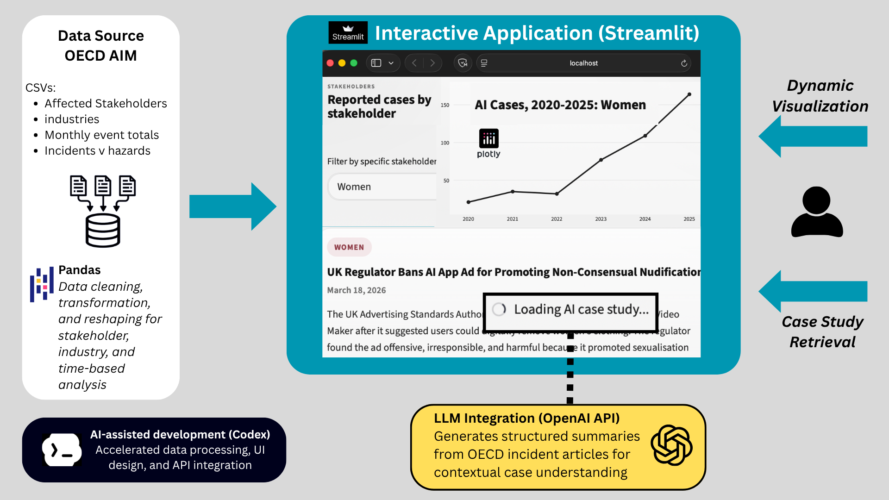

# Reported AI Cases Dashboard

Interactive Streamlit dashboard for exploring reported AI incidents and hazards from the OECD AI Incidents and Hazards Monitor, with stakeholder trends, industry patterns, downloadable source data, and AI-generated case study summaries.

Live app: https://ai-incidents-dashboard.streamlit.app

## Overview

This project turns OECD AIM source data into a browsable dashboard focused on reported AI cases from 2020-2025, with an option to include partial 2026 data in the Explore view. It is designed to help users quickly see:

- how reported AI cases change over time
- which stakeholder groups appear most often in reported cases
- which industries are most exposed in the dataset
- how incidents compare with hazards in the source material
- one contextual case study tied to a selected stakeholder

The dashboard is meant to help users:

- identify patterns in reported AI harm across industries and stakeholder groups
- connect aggregated data to real-world cases so AI harm feels more concrete in practice
- move beyond high-level trends to examine example cases, including harms that may not yet be fully captured at scale

The app is organized into four sections:

- `Overview`: high-level metrics and summary visualizations
- `Explore`: interactive filtering by year range and stakeholder, plus related case study retrieval
- `About the Data`: source notes, methodology context, and limitations
- `Downloads`: preview and export of the datasets used in the dashboard

## How It Works

The app combines cleaned OECD AIM datasets, interactive Streamlit views, and OpenAI-powered case study summaries to make the source material easier to explore.



## Data Source

The dashboard uses data from the OECD AI Incidents and Hazards Monitor:

- OECD AI Incidents and Hazards Monitor: https://oecd.ai/en/incidents
- OECD incidents methodology: https://oecd.ai/en/incidents-methodology

The included datasets cover:

- affected stakeholders
- industries
- monthly incident and hazard totals
- incident versus hazard counts over time

These counts reflect reported and coded cases in the OECD monitor, not a complete count of all real-world AI harms.
The overall incident totals count reported cases over time, while the stakeholder and industry datasets count category assignments. A single reported case can appear under more than one stakeholder or industry, so those category totals can be higher than the overall incident total.

## AI Case Study Retrieval

The Explore tab includes stakeholder-linked case study summaries. The app:

1. builds an OECD incident search URL for the selected stakeholder
2. fetches the relevant OECD incident page content
3. uses the OpenAI API to generate a short structured summary and relevance note

Preloaded case-study data is stored locally in `data/preloaded_case_studies.json` so the first result can load more smoothly.

## Tech Stack

- `Streamlit` for the app interface
- `Pandas` for data cleaning, reshaping, and filtering
- `Plotly` for interactive charts
- `Requests` and `BeautifulSoup` for OECD page retrieval and parsing
- `OpenAI API` for case study summarization

## Project Structure

```text
.
├── app.py
├── ai_lib/
│   ├── dataframes.py
│   ├── openai_api.py
│   └── __init__.py
├── data/
│   ├── aim_affected_stakeholders.csv
│   ├── aim-industries.csv
│   ├── aim-incidents.csv
│   ├── aim-severity.csv
│   └── preloaded_case_studies.json
├── styles/
│   └── front_end.css
└── requirements.txt
```

## Running Locally

Install dependencies:

```bash
pip install -r requirements.txt
```

Set your OpenAI API key if you want case study generation to work:

```bash
export OPENAI_API_KEY=your_key_here
```

Start the app:

```bash
streamlit run app.py
```

## Notes

- The case study feature depends on external OECD pages and an OpenAI API key.
- The dashboard emphasizes reported patterns in the source data, not definitive measurements of real-world harm.
- Some stakeholder groups are not cleanly separated in the source taxonomy, which affects what can be compared directly in the app.

## Repository Description

Streamlit dashboard for analyzing reported AI incidents from 2020-2025, with stakeholder comparisons, industry trends, and related case studies.
